  

<h1 align="center">🌟 HABIT ARENA 🌟</h1>
<h3 align="center">“Turn your habits into a game. Win your life like a warrior.”</h3>

Inspired by <strong>Atomic Habits</strong> by <em>James Clear</em>

---

🚀 **LIVE GAME:** https://thehabitarena.netlify.app/  
🎮 **Version:** V1 (Public Preview)  
🧠 **Tech Stack:** FastAPI + SQLModel + Vanilla JS + Netlify + Render

---

## 🧩 What is Habit Arena?

Habit Arena is a **multiplayer habit-building game** where players:

- Create good habits ⚔️  
- Track their consistency 🔥  
- Earn coins for completing habits 💰  
- Lose coins for bad habits 😢  
- Maintain streaks for bonus rewards 💥  
- Climb the **Global Leaderboard** 🏆  
- Build discipline like a true warrior  

A blend of **Atomic Habits** + **Casual RPG Game Design**, built with Python + JavaScript.

---

## 🧪 LIVE FEATURES (V1)

### ✔️ User System
- Username + password login  
- Secure password hashing  
- Persistent user data  
- Background music + UI sound effects  

### ✔️ Habit System
- Add habits (max 10 per user)  
- Max 2 bad habits  
- Daily habit completion  
- Streak tracking  
- Penalties for bad habits  
- Animated reward/penalty popups  

### ✔️ Leaderboard
- Ranked by coin count  
- SVG rank badges (gold/silver/bronze)  
- Smooth animations  

### ✔️ UI & Experience
- Animated SVG logo  
- Gradient dark theme  
- Hover & click sound effects  
- Beautiful error popups  
- Smooth transitions  

🎯 **V1 is fully playable & surprisingly addictive.**

---

## 🏗️ Tech Stack

### 🖥️ Frontend
- HTML5  
- CSS3 (glassmorphism, gradients, animations)  
- Vanilla JavaScript  
- Animated SVGs  
- Netlify Hosting  

### ⚙️ Backend
- FastAPI  
- SQLModel  
- SQLite (V1)  
- Passlib bcrypt hashing  
- CORS enabled  
- Render Hosting  

---

---

## 🧪 Run Locally

### Backend

cd backend
python -m venv venv
venv/Scripts/activate
pip install -r requirements.txt
uvicorn app.main:app --reload
---

## 📕 Core Game Logic

### 🎁 Reward System

good habit → +10 coins + streak bonus(streak*2)
bad habit → -8 coins - streak panalty(streak*5)
streak bonus → +1 per consecutive day

### ⏳ Daily Reset
- Habits reset at midnight  
- Missing a day breaks the streak  

### 🔐 Authentication
- Secure password hashing with bcrypt  

---

## 🏆 Upcoming Features (V2)

- ⚔️ 7-Day Challenge Arena  
- 👥 Friend System  
- 🛡️ Streak Protection  
- 🛒 Shop (skins, boosters, troop packs)  
- 📱 Mobile App Version  
- 🔄 Migrate DB to PostgreSQL  
- 🎨 Full UI Redesign  

---

## ⭐ Credits

**Developed by:** Sashwat Jain  
**Inspired by:** *Atomic Habits* — James Clear  

Built with 💙 discipline, creativity, and passion.

---

  
  
  
  
  
  
  

